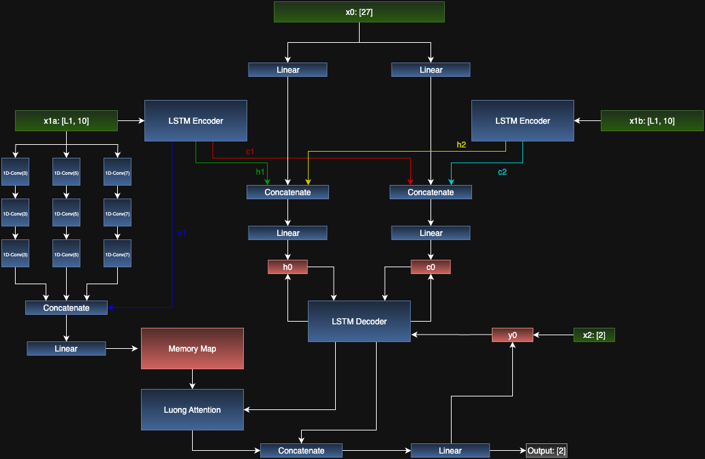

Documentation for Sequence to sequence models

Model takes in data from all pre-throw data of the receiver/db, and quarterback, as well as the frame_id (the # of seconds after throw / 10) and predicts the player's position.
Even if passer data is not available, model still works.

Files:
- best_model.pth: Model weights for MultiScaleCNNLSTMSeq2Seq class with hidden_dim=64 and known pre-submission approximate RMSE. Submitted to competition.
- submitted_model.pth: Model weights for MultiScaleCNNLSTMSeq2Seq class with hidden_dim=64 and trained right up until competition deadline. Submitted to competition.
- Data_saver.ipynb: Creates train_set.pt and test_set.pt (not uploaded). These datasets are used to train the model.
- MS-Seq2Seq-train.ipynb: Used to train MultiScaleCNNLSTMSeq2Seq locally.
- MS-Seq2Seq-eval.ipynb: Has code needed to create a submission.csv. Unnecessary when submitting to kaggle.

Data: 
Datasets created via Data_saver.ipynb
  - ids: the full play id (used only for model examination and debugging)
  - x0: a constant np.array of 27 constant features:
    - qb and receiver/db height, weight, starting x and y, ending x and y, ending orientation, ending component velocities, ending acceleration
    - predicting player's role (0 for defense, 1 for offense)
    - number of output frames (ball in air duration/10)
  - x1a: np.array of (num_input_frames, 10). Each frame has 10 features for the player of interest
    - x,y position
    - component velocities
    - component acceleration
    - component orientation
    - speed and |acceleration|
  - x1b: np.array of (num_input_frames, 10). Same as x1a but for the passer on the play. May be empty if no passer info given
  - x2: np.array with two numbers: last known x and y of player of interest.
  - targets: np.array of (num_output_frames, 2). Contains target for a play. Only in train dataset
  - duration: number of frames needed to predict for a training instance.

Design:
The MultiScaleCNNLSTMSeq2Seq class is a mixed model with 2 LSTM encoders and 3 encoding CNNs. The decoder is another LSTM which uses the total encoding and Luong Attention to predict x and y positions sequentially.

x1a and x1b, the sequential input for a player and the quarterback, is passed through seperate LSTMs to generate hidden and cell states. In the case x1b is empty (no QB data given), learned constant hidden and cell states are used. Parallel to this, x0, a single dimensional input, is passed through two linear layers. This output and the cell and hidden states from both LSTMs are combined into cell and hidden states (h0 and c0) for the decoder through concatenation and linear layers.

In order to use Luong Attention, a memory tensor was needed to encode each frame. This utilized the encoder output of the LSTM for x1a and 3 CNNs using x1a. The CNNs each have 3 1-D CNNS using kernel sizes of 3, 5, and 7 in order to capture both long and short patterns/dependencies. These concatenated encodings are then passed through a linear layer to create our sequential memory.

The LSTM decoder takes in a y0, and the learned hidden and cell states (h0 and c0). y0 is initially x2, the last known position. Luong attention is computed with the memory map and the decoder output. The attention is then concatenated with the decoder output to generate botht the output and the y0 used in the next iteration of the decoder. The decoder is looped however many frames need to be predicted.

During training, teacher forcing makes it so y0 occasionally uses the previous target instead of the previous prediction. This is gradually phased out. Other model parameters are:
- Number of folds = 5
- Epochs = 20 (sometimes more)
- Learning rate scheduler (patience = 3, factor=.5)
- Learning rate = .00005
- Dropout = .01 (very little overfitting from what I saw)
- Teacher forcing: 80% --> 20%
- Batch size = 1
Trained using one play at a time because it was the easiest way to make dimensions consistent. Didn't want implement padding.

Ultimately the design of this model was to facilitate long and short sequential pattern based recognition through the multiple CNNs as well as other hard to capture relationships with the LSTM encoders. The decoder's advantages is using the previous output to make the next output and using the memory map as well as hidden states to guide y0 in the right direction.

Tenseor transpositions, squeezes, and stacks not included in diagram.

Results:
Submissions
- best_model (hidden_dim = 64):
  - local approx RMSE (at time of submission): .80
  - competition RMSE: .79708
- submitted model (hidden_dim = 64):
  - competition RMSE: .81202
- MS-CNN-LSTM-Seq2Seq-10 (hidden_dim = 64):
  - competition RMSE (trained after competition): .69222

  
Other experiments
- hidden_dim = 32: local approx RMSE: .83
- hidden_dim = 128: .97
- hidden_dim = 256: 1.2
Models not uploaded.

Conclusion: 
Using a hidden dimension of 64 was the best at balancing robustness and speed of training. With higher hidden dimensions means exponentially more parameters which took too long to train given competition constraints. A 32 feature hidden dimension trained for roughly the same time as for the 64 instance, with slightly lower accuracy. Seq2seq substantially outperformed frame by frame models by about .3 RMSE.
Some improvements that could be made:
- GPU training
- Could explore using a transformer archicture

Other notes:
- If using locally, some file names in notebooks are hardcoded in and are inconsistent.
- I really appreciate it if anyone took the time to read any of this
